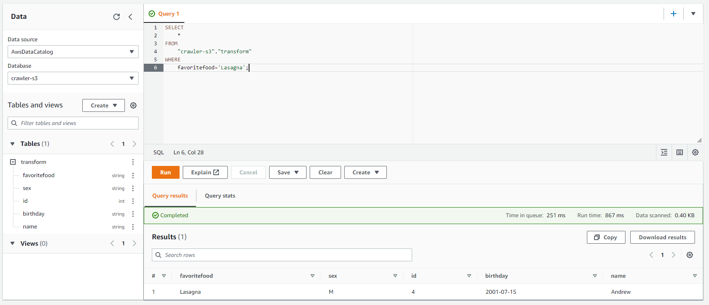

# aws-glue-etl-s3-athena


## Create the infrastructure

```sh
touch .auto.tfvars
```

Add the variables according to your preferences. Example:

```hcl
# The role to be assumed by Terraform to create the resources
assume_role_arn = "arn:aws:iam::000000000000:role/OrganizationAccountAccessRole"

# Region to create the resources
region = "sa-east-1"

# Availability Zones
availability_zones = ["sa-east-1a", "sa-east-1b", "sa-east-1c"]
main_az            = "sa-east-1a"

# RDS Aurora credentials
master_username = "etluser"
master_password = "passw0rd"
```

Apply Terraform:

```sh
terraform init
terraform apply -auto-approve
```

Once ready, enter the Glue Studio and test the connector to the RDS database.

## Generate database data

Connect to the Jumpbox VM using instance connect, and then connect to the database:

```sh
mysql -u 'etluser' -p'passw0rd' \
    -h 'aurora-mysql-instance.cq1qsu0anb1o.sa-east-1.rds.amazonaws.com' \
    -P 3306 \
    -D 'testdb'
```

Apply the [`prepare-database.sql`](./prepare-database.sql) script to generate data.

## Glue ETL Job

First, run the crawler feed the database catalog.

```sh
aws glue start-crawler --name 'rds-aurora-crawler'
```

Connect to the AWS Glue Studio and go to the Jobs blade. Create a new Job:

- Source: AWS Glue Database Catalog
- Target: S3

Enter JSON for the output format, and fill it in the required information.

Save the job. File [auto-generated-script-example.py](./auto-generated-script-example.py) is reference of what Glue will generate.

Run the ETL job and check the output files in S3:

```json
{"favoriteFood":"Pasta","sex":"M","id":2,"birthday":"1998-03-15","name":"John"}
```

## Athena

Athena needs an S3 data source. Use Glue again to prepare an Athena table:

1. Create a new database on Glue
2. Create a new crawler that will read the S3 JSON data and feed the new Glue database.
3. Run the crawler
4. Go to Athena and add a query result location on S3

You should now be able to run a query against the S3 data:

```sql
SELECT* FROM "crawler-s3"."transform" WHERE favoritefood='Lasagna';
```

Results:



---
### Clean-up

Delete the manually created Glue Jobs, Crawlers, Database, Table, S3, CloudWatch Logs.

Run `terraform destroy -auto-approve` to remove the infrastructure.
